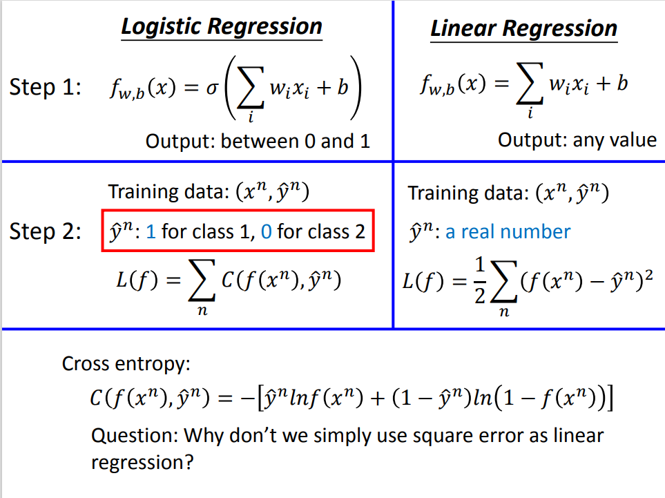

# Classification_Note

> @ wyfffffei


## Binary Classification

### Logistic Regression

Regression 模型用于对连续数据进行预测，而 logistic regression 模型则是应用于分类问题。

### Sigmoid

由于存在梯度消失的问题，Sigmoid 函数不会应用于隐藏层，但像二分类的逻辑回归模型，该函数往往会被应用于输出层，它的输出介于0和1之间

 

### 二分类交叉熵

在深度学习模型中常见的损失函数有 交叉熵（Cross-Entropy, CE）和均方误差（Mean Squared Error, MSE）。在回归类问题中，常用‘均方误差’作为损失函数，在分类问题中常用‘交叉熵’

 

交叉熵公式：

 

- 二分类：BCE
- 多分类：CCE

### 独热编码（One-Hot Encoding）

类别表示法，对于没有连续关联的类别，如使用0、1、2...方法表示，则存在1比2更接近0的潜在关系；

独热编码将类别以若干个‘0’或1个‘1’表示，如果有N个类别，就以“N-1个0”和“1个1”来表示，确保类别与类别之间是完全独立的

### 应用

> 名称：Pokemon-Challenge
>
> 数据集：<https://www.kaggle.com/terminus7/pokemon-challenge>

#### 数据预处理

```python

```


