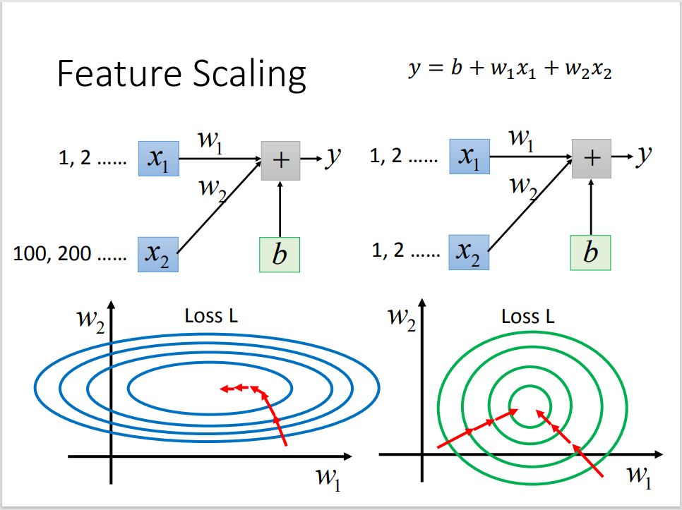

# Regression Cheat Sheet

> @ wyfffffei
>
> 示例数据集：<https://www.kaggle.com/harlfoxem/housesalesprediction>


## Data Init

### 数据检查

```python
import pandas as pd
import numpy as np
data = pd.read_csv("xxx.csv")
pd.options.display.max_columns = 25

# -> (数据总数, 每笔数据包含的信息数)
print(data.shape)

# 默认输出前五条
print(data.head())

# 检查数据类型
print(data.dtypes)
```

### 数据预处理

```python
# 数据拆分: date -> year + month
data["year"] = pd.to_numeric(data["date"].str.slice(0, 4))
data["month"] = pd.to_numeric(data["date"]).str.slice(4, 6)

# 删除多余数据 ('inplace'指删除源数据)
data.drop(["id"], axis="columns", inplace=True)
data.drop(["date"], axis="columns", inplace=True)

# 数据分割
# 获取数据索引并打乱
data_num = data.shape[0]
indexs = np.random.permutation(data_num)

# 划分三类数据集的索引 (0.6 + 0.2 + 0.2)
train_indexs = indexs[:int(data_num * 0.6)]
val_indexs = indexs[int(data_num * 0.6) : int(data_num * 0.8)]
test_indexs = indexs[int(data_num * 0.8):]

# 通过索引取出数据
train_data = data.loc[train_indexs]
val_data = data.loc[val_indexs]
test_data = data.loc[test_indexs]
```


### 归一化（Normalization）

 

```python
# Standard Score (z-score)
# mean: 平均值
# std: 标准差
# x_norm = (x - mean) / std

train_validation_data = pd.concat([train_data, val_data])
mean = train_validation_data.mean()
std = train_validation_data.std()

train_data = (train_data - mean) / std
val_data = (val_data -mean) / std
```


### 建立 Numpy 格式数据集

```python
# 训练输入值和预计输出值
x_train = np.array(train_data.drop("price", axis="columns"))
y_train = np.array(train_data["price"])

# 验证数据集同上
# x_val = ...
# ...

# 查看训练数据集总数
print(x_train.shape)
```


## Model Create


