# Regression And DeepLearning

> @ wyfffffei
> 
> 示例数据集：<https://www.kaggle.com/harlfoxem/housesalesprediction>

## Data Init

### 数据检查

```python
import pandas as pd
import numpy as np
data = pd.read_csv("xxx.csv")
pd.options.display.max_columns = 25

# -> (数据总数, 每笔数据包含的信息数)
print(data.shape)

# 默认输出前五条
print(data.head())

# 检查数据类型
print(data.dtypes)
```

### 数据预处理

```python
# 数据拆分: date -> year + month
data["year"] = pd.to_numeric(data["date"].str.slice(0, 4))
data["month"] = pd.to_numeric(data["date"]).str.slice(4, 6)

# 删除多余数据 ('inplace'指删除源数据)
data.drop(["id"], axis="columns", inplace=True)
data.drop(["date"], axis="columns", inplace=True)

# 数据分割
# 获取数据索引并打乱
data_num = data.shape[0]
indexs = np.random.permutation(data_num)

# 划分三类数据集的索引 (0.6 + 0.2 + 0.2)
train_indexs = indexs[:int(data_num * 0.6)]
val_indexs = indexs[int(data_num * 0.6) : int(data_num * 0.8)]
test_indexs = indexs[int(data_num * 0.8):]

# 通过索引取出数据
train_data = data.loc[train_indexs]
val_data = data.loc[val_indexs]
test_data = data.loc[test_indexs]
```

### 归一化（Normalization）


```python
# Standard Score (z-score)
# mean: 平均值
# std: 标准差
# x_norm = (x - mean) / std

train_validation_data = pd.concat([train_data, val_data])
mean = train_validation_data.mean()
std = train_validation_data.std()

train_data = (train_data - mean) / std
val_data = (val_data -mean) / std
```

### 建立 Numpy 格式数据集

```python
# 训练输入值和预计输出值
x_train = np.array(train_data.drop("price", axis="columns"))
y_train = np.array(train_data["price"])

# 验证数据集同上
# x_val = ...
# ...

# 查看训练数据集总数
print(x_train.shape)
```

## Model Create

```python
class FullConnection(nn.Module):
    def __init__(self):
        super(FullConnection, self).__init__()
        self.model = nn.Sequential(
            nn.Linear(784, 200),
            nn.LeakyReLU(inplace=True),
            nn.Linear(200, 200),
            nn.LeakyReLU(inplace=True),
            nn.Linear(200, 10),
            nn.LeakyReLU(inplace=True)
        )

    def forward(self, x):
        x = self.model(x)
        return x

# func = FullConnection()
# input = torch.randn(784, requires_grad=True)
# out = func(input)
# print(out)

device = torch.device("cpu")
net = FullConnection().to(device)
learning_rate = 1e-2
epochs = 100
optimizer = optim.Adam(net.parameters(), lr=learning_rate)
loss_func = nn.CrossEntropyLoss().to(device)
train_data, test_data = dataloader()
logger = SummaryWriter("./logs_train")
```

## Train the Model (step)

```python
for epoch in range(epochs):
    # 一轮训练
    net.train()
    for batch_id, (tra_data, tra_target) in enumerate(train_data):
        tra_data, tra_target = tra_data.to(device), tra_target.to(device)
        pre_train = net(tra_data)
        loss = loss_func(pre_train, tra_target)
        optimizer.zero_grad()
        loss.backward()
        optimizer.step()

        if batch_id % 10 == 0:
            print("Train Epoch : {} [{}/{} ({:.0f}%)]\tLoss: {:.6f}".format(
                epoch, batch_id*len(tra_data), len(train_data), 100.*batch_id/len(train_data), loss.item()
            ))
            logger.add_scalar("train_loss", loss.item(), batch_id)
```

## Test the Model (step)

```python
net.eval()
test_loss = 0
accurancy = 0
with torch.no_grad():
    for tes_data, tes_target in test_data:
        tes_data, tes_target = tes_data.to(device), tes_target.to(device)
        pre_test = net(tes_data)
        test_loss += loss_func(pre_test, tes_target).item()
        accurancy += (pre_test.argmax(1) == tes_target).sum()
test_loss /= len(test_data
print("\nTest set : Average loss: {:.4f}, Accurancy: {}/{}({:.3f}%)".format(
    test_loss, accurancy, len(test_data), 100.*accurancy/len(test_data)
))
logger.add_scalar("test_loss", test_loss, epoch)
logger.add_scalar("test_accuracy", accurancy, epoch) 
```

## Better Training

### 变化的学习率（Adaptive Learning Rate）

#### Adagrad

根据梯度，不断调整学习率（步长），大梯度走小步，小梯度走大步

优点：适合处理稀疏数据，可以显著提高SGD的稳健性，不需要手动调整学习率

缺点：在分母中累计平方梯度，会导致 early stopping 现象，即学习率过早变小，导致模型还未收敛就停滞不前

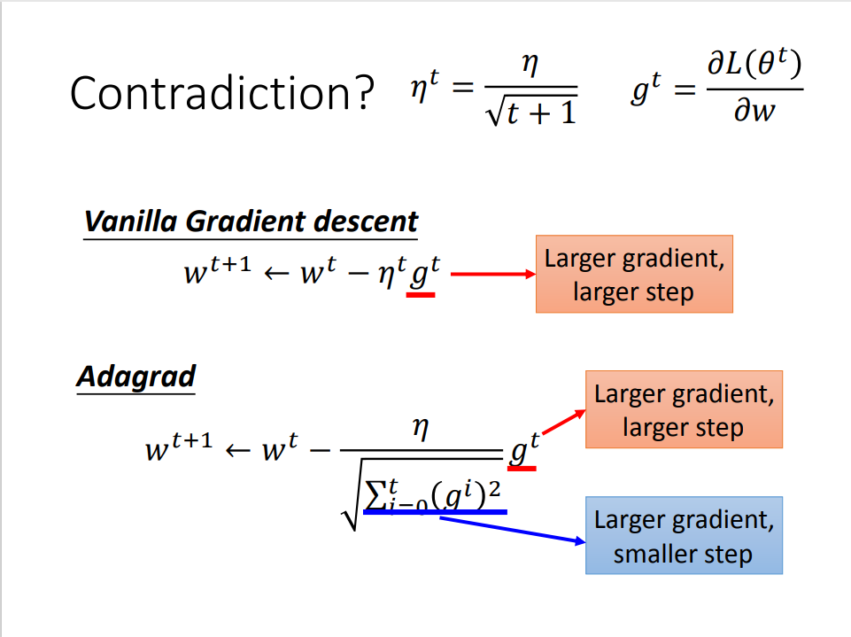

```python
grad_squared = 0
while True:
    dx = compute_gradient(x)
    grad_squared += dx * dx
    x -= learning_rate * dx / (np.sqrt(grad_squared) + 1e-7)
```

#### RMSProp

采用指数加权平均的思想，只将最近的梯度累加计算平方，这避免了 early stopping 现象

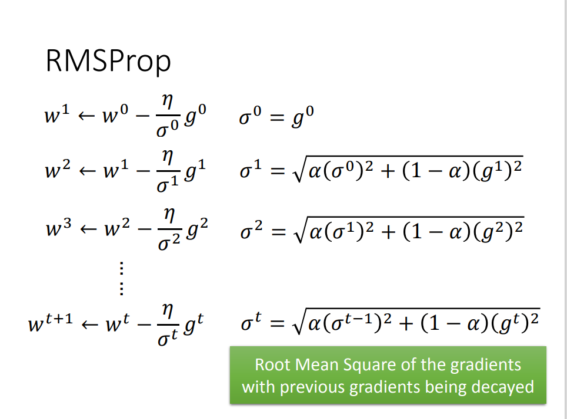

```python
grad_squared = 0
while True:
    dx = compute_gradient(x)
    grad_squared = decay_rate * grad_squared + (1 - decay_rate) * dx * dx
    x -= learning_rate * dx / (np.sqrt(grad_squared) + 1e-7)
```

#### Momentum

优点：避免梯度下降时停滞在 local minima，增加一个原来的方向的冲量（惯性）

缺点：不能保证突破 local minima

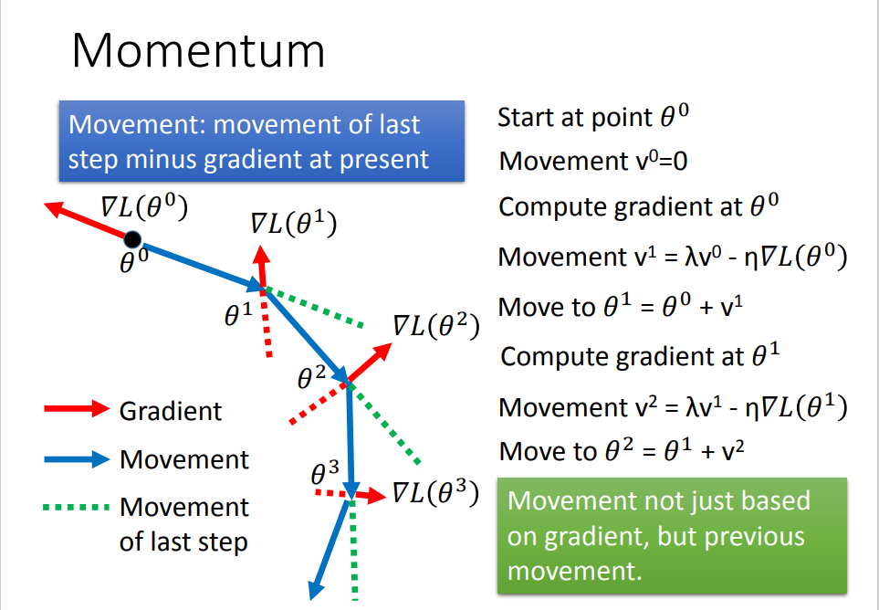

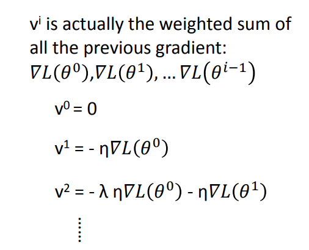

#### Adam ✔

RMSProp + Momentum

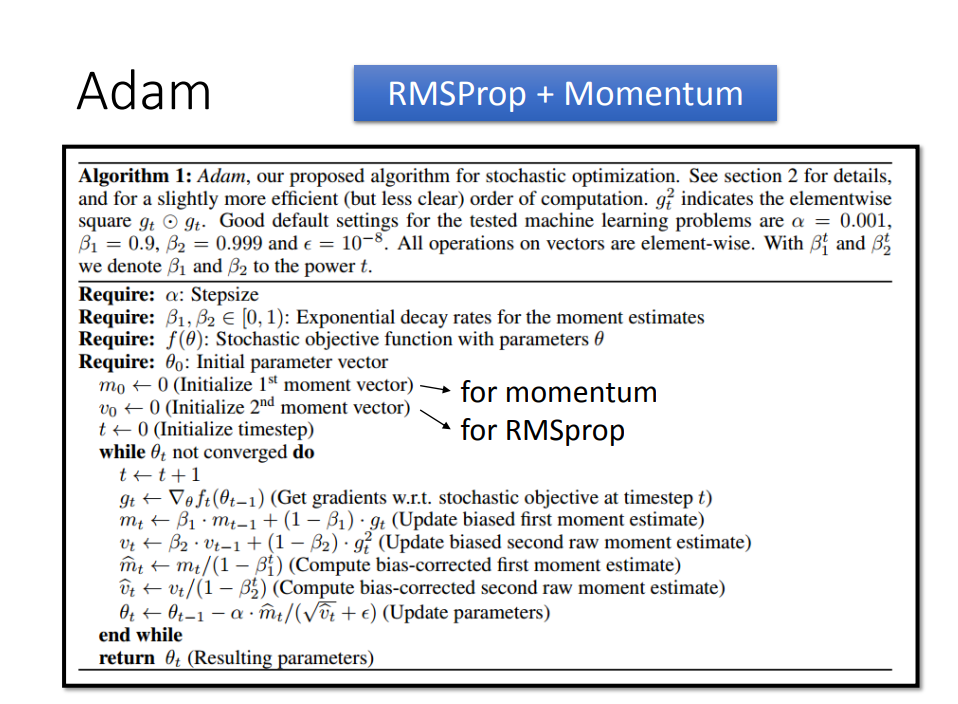

### 梯度消失（Vanishing Gradient Problem）

*Q：训练时，梯度时大时小，不稳定*

*A：使用激活函数，统一输出*

#### ReLU

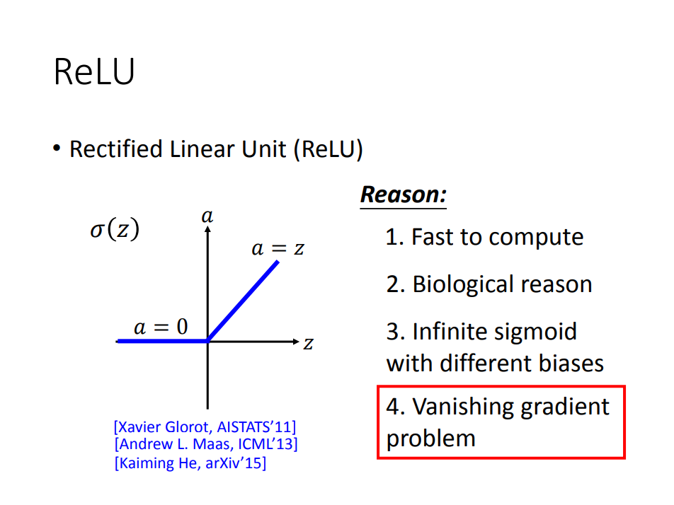

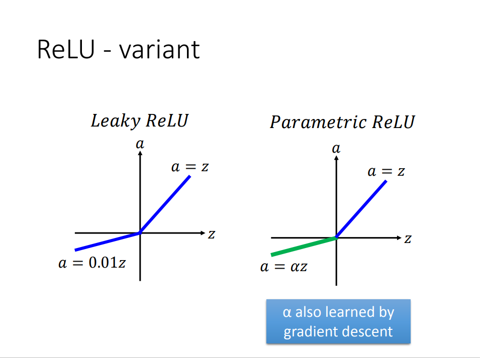

#### Maxout

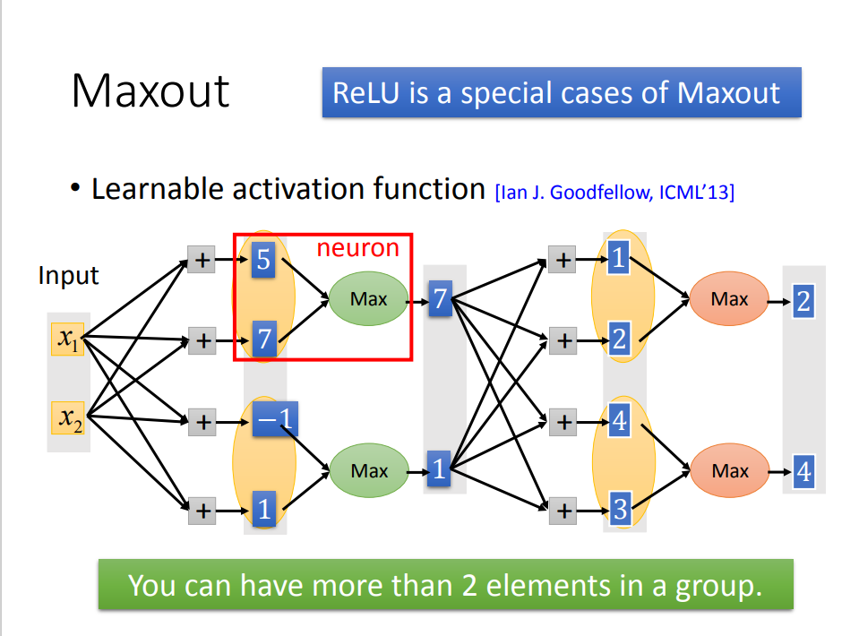

## Better Testing

### 过拟合（overfitting）

*Q：训练的网络模型对验证数据集性能很差（Loss先降后升），但对训练数据集性能很好*

*A：模型太复杂或者训练数据太少*

 

#### 提早结束（Early Stopping）

> <https://keras.io/getting-started/faq/#how-can-i-interrupt-training-whenthe-validation-loss-isnt-decreasing-anymore>

#### 缩减模型大小

避免过拟合，但也可能造成模型还未收敛完全

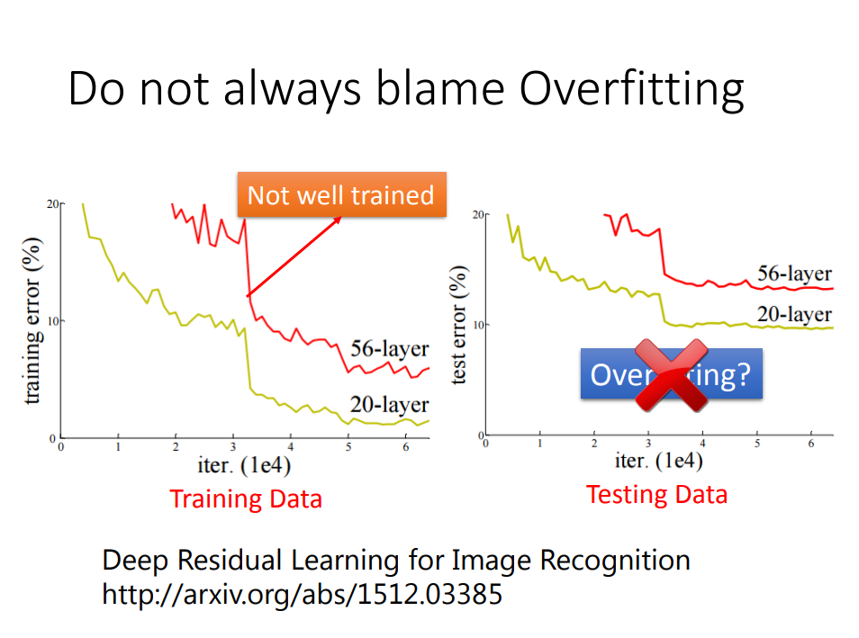

#### 权重正则化（Weights Regularization）

在模型的拟合过程中，权重越小，函数往往越平滑，因此在 loss function 的基础上在加一个和所有权重相关的值，目的是使权重也尽可能的小，不互相依赖


- L1 Regularization：$Loss_T = Loss_M + λΣ_j|w_j|$

- L2 Regularization：$Loss_T = Loss_M + λΣ_j|w_j²|$

*w* ：模型的权重

*j* ：代表模型的权重数量（0 -> M）

*$Loss_M$*：代表损失函数为均方误差

*$Loss_T$*：为“损失值”和“正则化权重”之和

*$λ$*：可调整参数，用来控制权重正则化强度，选取方案 👇

 

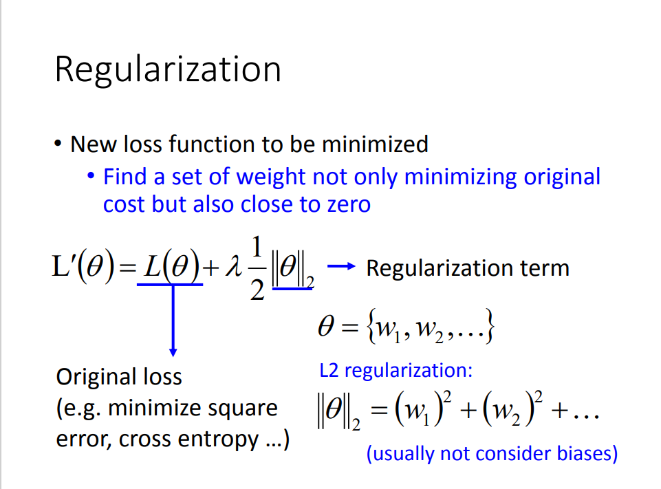

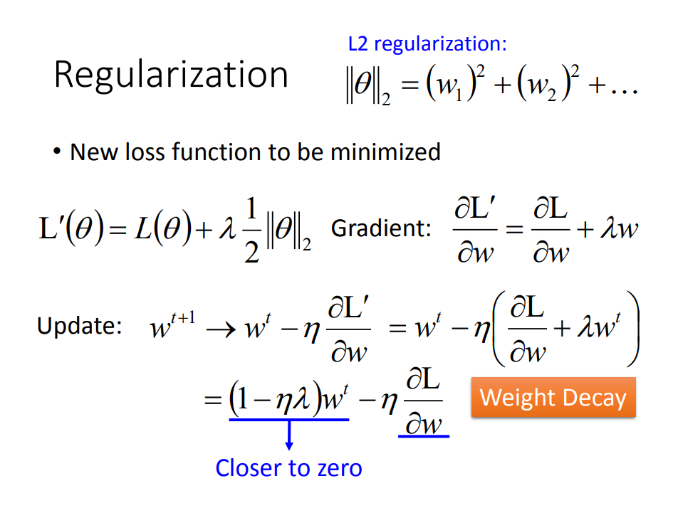

#### Dropout

在每次训练时，随机失活部分参数（仅在训练中使用），避免神经元过分依赖局部特征

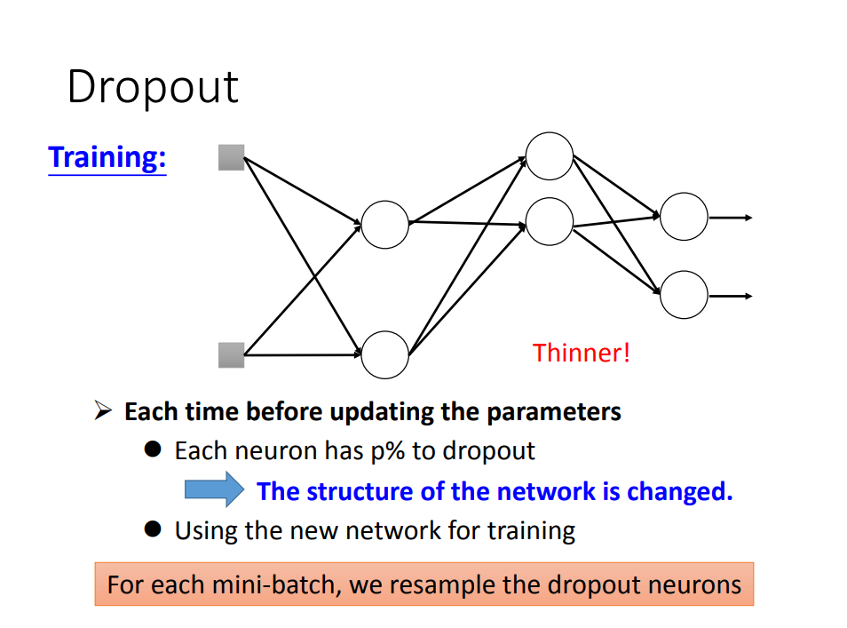


